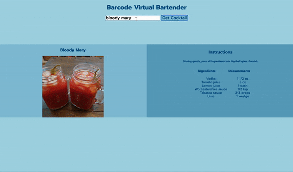

<!--  -->

### About Me

I am a full-stack software engineer with a background in education and a passion for problem solving. Throughout my career I have had a knack for building new projects, being a team player, and thinking on my toes. 

### Technologies

<table bordercolor="#66b2b2">
<tr>
    <td width="50%" valign="top">
      <h3 align="center">CineFacts</h3>
         
        
         
        

          
    
  
      

        
<strong>

    </td>
    <td width="50%" valign="top">
      <h3 align="center">Barcode Virtual Bartender</h3>
         
      
         
        

          
  
  
      

        
<strong></strong> - 

    </td>
  </tr>
   <tr>
    <td width="50%" valign="top">
      <h3 align="center">Pictures From Mars</h3>
       
        
       
        

  
  
      

        
<strong>

    </td>
    <td width="50%" valign="top">
      <h3 align="center">NASA Picture of the Day</h3>
         
        
         
        

          
  
  
      

        
<strong>

    </td>
  </tr>
</table>

### Projects
<table>
 <tbody>
   <tr>
   <td>
       <a href="#"> 
       <a href="#">
       <a href="#">
    </td>
    <td>
        <a href="#"> 
        <a href="https://github.com/April-Yuen/Barcode-Virtual-Bartender">
        <a href="https://barcoderevised.netlify.app/">
     </td>
  
   </tr>
     <tr>
    <td>
        <a href="#"> 
        <a href="#">
        <a href="https://marsroverapi.netlify.app/">
    </td>
      <td>
        <a href="#"> 
        <a href="#">
        <a href="https://nasaapodapi1.netlify.app/">
      </td>
   </tr>
   </tbody>
</table>
<!--  -->

### How To Reach Me
 

- 😄 Pronouns: she/her

